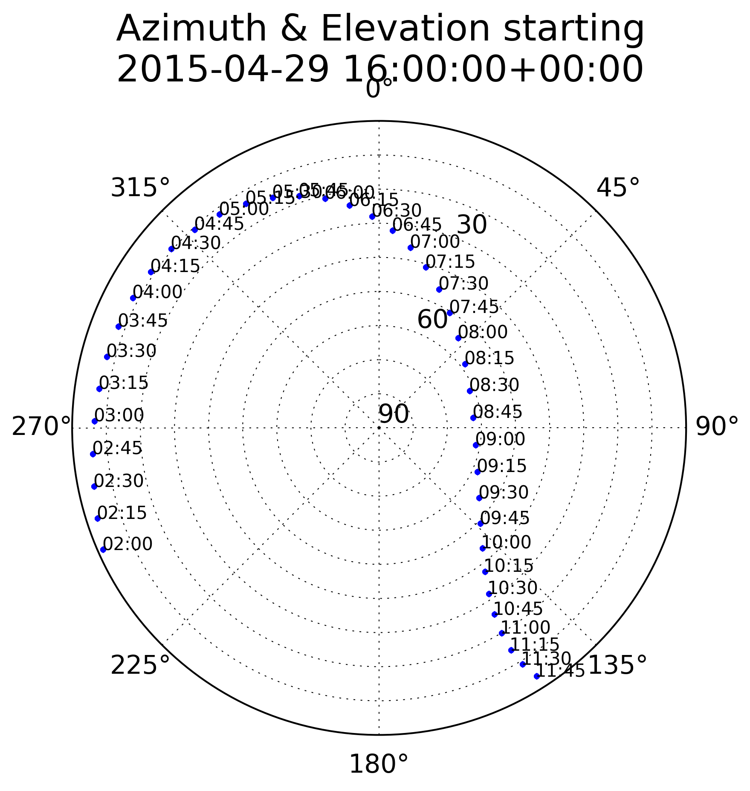

[](https://landscape.io/github/scienceopen/satkml/master)

satkml
======

Plot satellite az/el, and make KML of satellites for visualization in Google Earth.

Installation:
-------------
```
git clone https://github.com/scienceopen/satkml
conda install --file requirements.txt
pip install simplekml
```




Example Use
-----------
You need to have the ephemeris files for the satellite(s) you want to plot.
In this example I'm using GPS satellites.
You can manually download ephemeris from [Dr. Kelso's](http://www.celestrak.com/webmaster.asp) Celestrack website via your web browser, or use curl or wget.
```
wget http://celestrak.com/NORAD/elements/gps-ops.txt
```

Plot satellites at one time:
```
python satplot.py gps-ops.txt 2015-05-12T16:00:00 -k out.kml -l 65 -148 0
```

Plot satellites for a range of time:
```
python satplot.py gps-ops.txt 2015-05-12T16:00:00 2015-05-12T17:00:00 -l 65 -148 0
```

The main data product of the program is a 3-D pandas Panel named "data" 
with dimensions time x satnum x parameter

------------------------------------------------------------

Alternate, manual install (not needed for most users)
-----------------------------------------------------
```
sudo apt-get install libgeos-dev libgeos++-dev
pip install basemap --allow-external basemap --allow-unverified basemap
```
or if that doesn't work for you installing basemap, try:
```
sudo apt-get install python-mpltoolkits.basemap python-mpltoolkits.basemap-data
```

matplotlib basemap references
-----------------------------
[basemap examples](http://introtopython.org/visualization_earthquakes.html)

[basemap API reference](http://matplotlib.org/basemap/)


